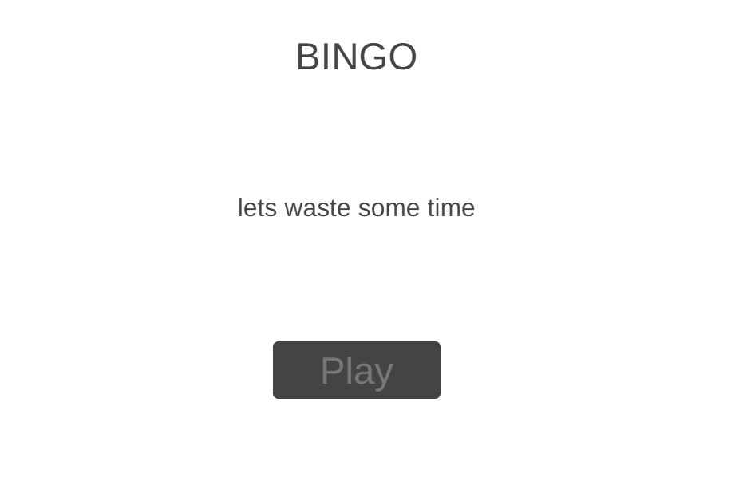
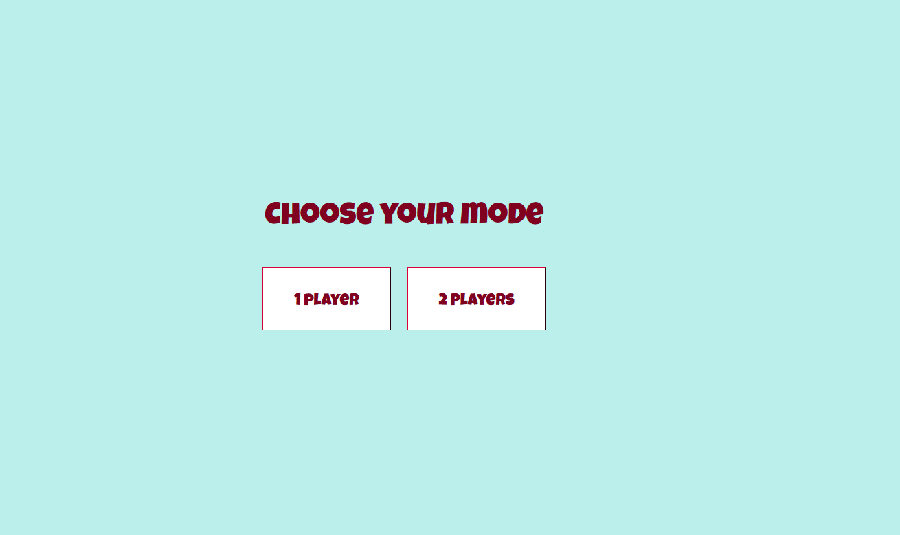

# BINGO

# Description
web based Bingo game supports 1 to 2 players. Built using HTML, CSS, Javascript. features of the game:
* Player have the option to play solo or to compete with a second player each with their own board.
* Each player get his own randomly generated 5 x 5 Bingo board.
* Numbers will be called randomly by the game without repetition.
* player will click on the numbers to mark thim until they get a row, column or diagonal line fully marked.
* Automatically checks for completed rows, columns, or diagonals to declare "Bingo".

## How to Get Started
To start with, i did a [To do list](https://trello.com/invite/b/686f5b574f570c1d435cf064/ATTIfaff42d135d057f11325792259bb0e5dCB42C017/bingo-list-to-do). Next, i did the [wirefram](https://wireframe.cc/pro/pp/98a717ff5963248). Folowed by the psoducode to act as refference to start the work later on.
**psoducode:**
// home page
// -Display button to start playing

//page 1
// -Creating buttons for THE PLAYER to choose the size of the boerd 

//page 2
// -Initialize a list of possible numbers based on the bored size
// -Creating a letter shaped buttons to cancel out the letters of the word 'BINGO'
//Starting the game
// - Player select a number from the list or numbers being randomly selected from the list without repeating
// -Display the drown number on the screen
// -player should check if the number exists on the board (if yes then the number should be marked)
// -Checking if the player got any row, column or diagonal to cancle one of the letters
// -Check if any player has won 
// -If a player wins display 'player wins'
// -optiions to 'play again' or 'restart the game' 

Creating a repositrie then clone it and creat an HTML, CSS and javascript files. then i will start by following the steps in the soducode.

# Procedure
Starting with HTML code to build the structure of the game.Next, started a bit on the styling of the game so that it can be imagenable. Then i worked on the javascript which took most of the time. Lastly, the final touches of the styling.

At the end click to try my [BINGO](https://bingo-game-s.surge.sh/) game many things and many ideas changed from the wirefram and the psoducode.
## Layout
### Plans for the Game
Homepage:

Page 1:

Playing page:

### Final layout
Homepage:

page 1:

1 Player page:

2 Players page:

## Conclusion
To sum up, the most enjoiable part for me was the HTML. I enjoyed imagining the structure of the game. When i started the java script i was lost at the beginning but when i started understanding i was enjoying the coding. The most difficult part was the CSS it was not working very well with me till the end.

# Credits
[Chatgpt](http://chatgpt.com/c/686f70b0-5350-8007-8d1e-10fed59104d7)